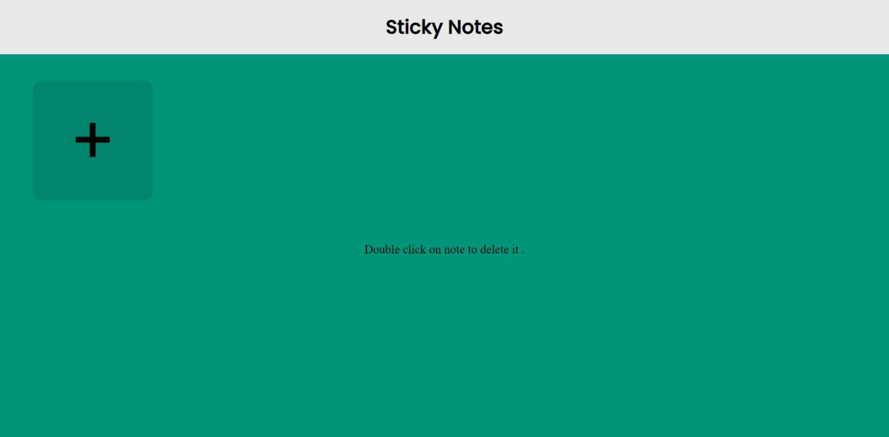
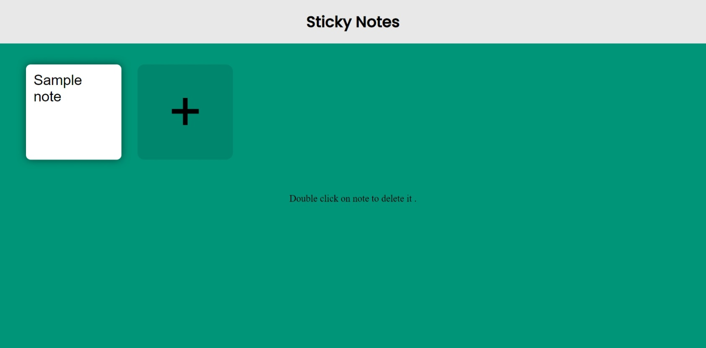
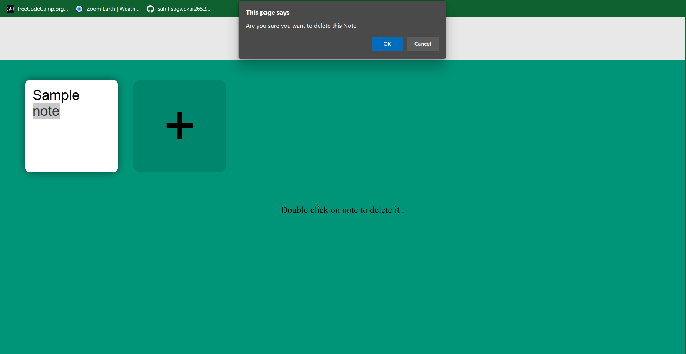

# Sticky Notes 📝

  

A lightweight note-taking webapp created using plain HTML, CSS and Javascript. Click on the '+' button to add a sticky note and Double click on a note to delete it.

## Languages  🧰

  

## Screenshots

  

New page
  

  

Create notes

Delete notes

